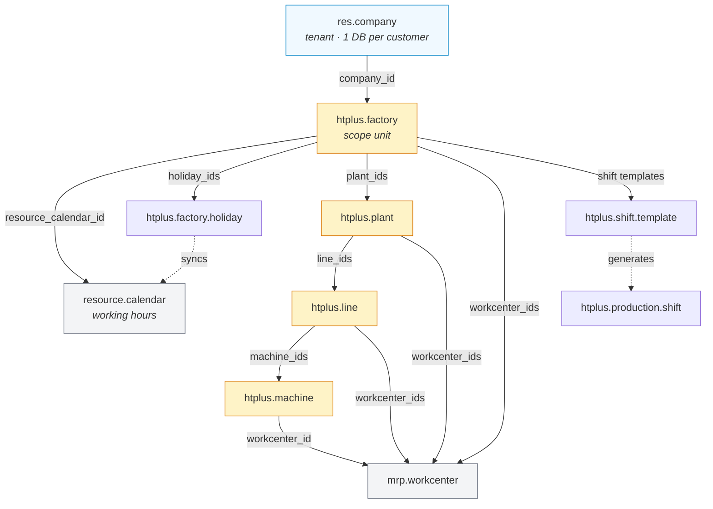
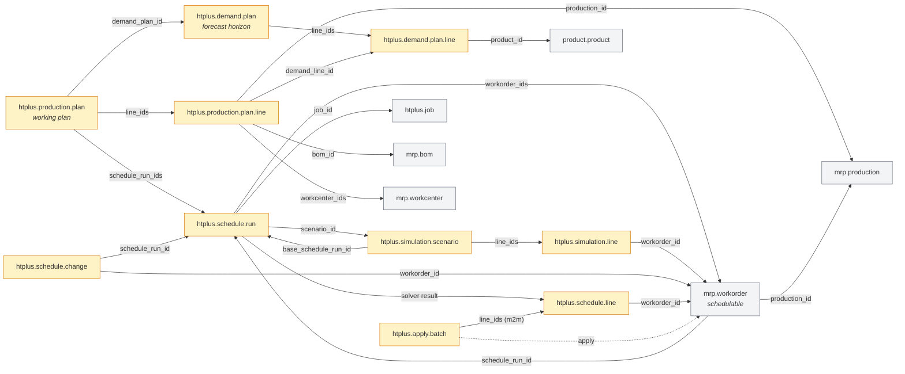
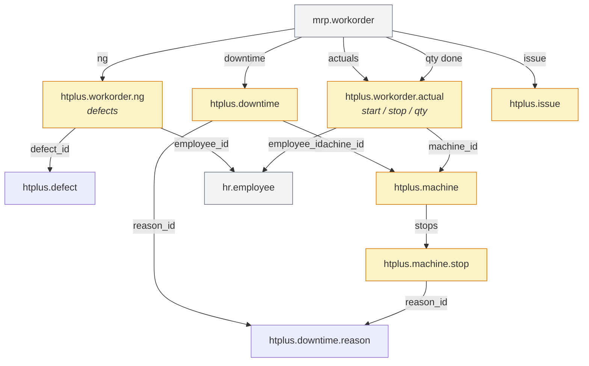
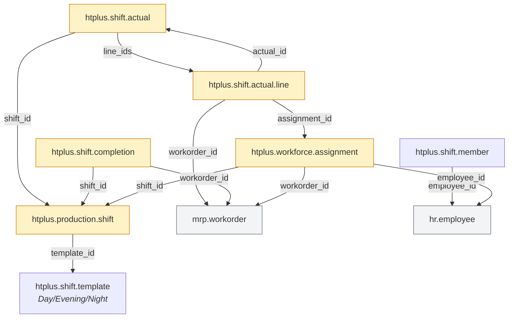
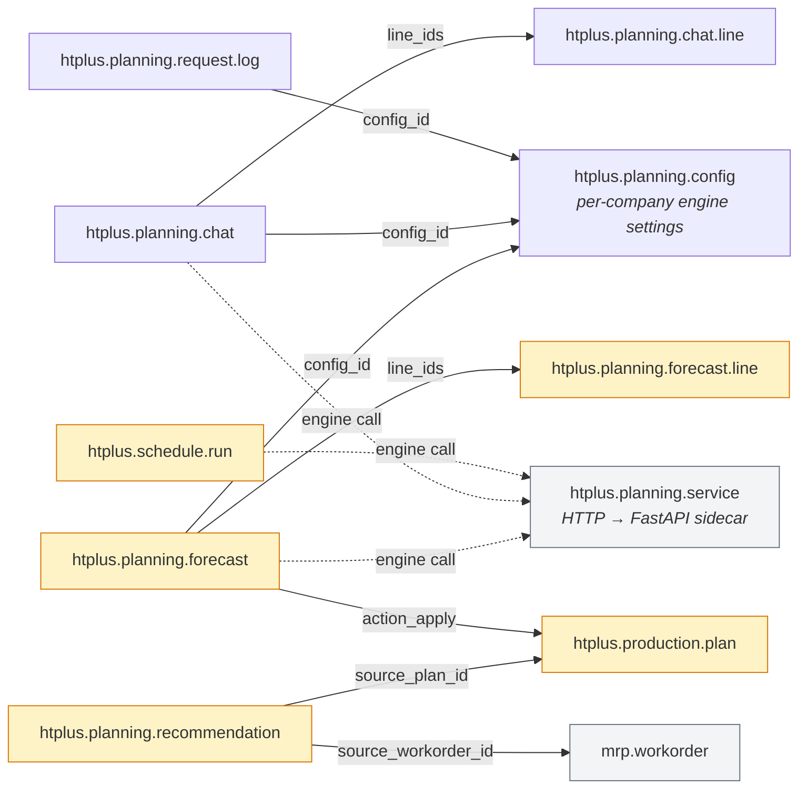

# HTPlus — Odoo 18 stack

Odoo 18 Community + PostgreSQL 17 + nginx + a FastAPI planning engine, with
separate development and production configurations.

```
addons/             first-party modules (htplus_*), written here
addons_vendor/      third-party modules, never edited in place
services/planning/  FastAPI planning engine, consumed by htplus_planning_bridge
config/             odoo.dev.conf, odoo.prod.conf  (templates, rendered at boot)
nginx/              dev.conf.template, prod.conf.template
secrets/            production credentials (git-ignored)
```

`addons/` and `addons_vendor/` are separate mounts (`/mnt/extra-addons` and
`/mnt/vendor-addons`) and `addons_vendor` is read-only in **both** environments:
a fix applied directly to a vendor module is silently lost the next time that
module is updated. Patch vendor behaviour from a first-party module instead.

## Quick start — development

```bash
cp .env.example .env          # then edit the CHANGE_ME values
make up
make logs
```

Odoo is on <http://localhost:8080> (through nginx) and <http://localhost:8069>
(direct). Everything is published on `127.0.0.1` only, so nothing is exposed to
your network.

| | |
|---|---|
| `make update M=htplus_aps_core` | upgrade a module |
| `make test M=htplus_aps_core`   | run a module's tests |
| `make shell`                    | interactive ORM shell |
| `make nuke`                     | wipe containers **and** the dev database |

Dev runs with `dev_mode = reload,qweb,xml,assets`, so Python and XML changes are
picked up without a rebuild. Addons are mounted read-write.

## Domain model — one company, many factories

The product is sold **one database per customer**. Inside that database the
`res.company` is the tenant, and the **factory is the unit of access control**:
all record rules scope by `htplus.factory` (via a denormalised, indexed
`factory_id`), and a user sees exactly the factories granted on their
`htplus_factory_ids`.

Every scoped model carries a stored `company_id` (derived from its factory)
plus `_check_company_auto`, and the relational links are marked
`check_company=True`, so the ORM refuses to build a record that crosses
companies. No company record rules are needed — this is a defensive guard, not
an isolation mechanism.

Edges below are the actual relational fields. A solid edge is a direct
`Many2one`/`One2many`, a dashed edge crosses into Odoo base models.

### 1. Factory structure — the access spine



### 2. APS planning flow — from forecast to a schedulable order



### 3. MES shop floor — actuals written back



### 4. Workforce — shifts, members and assignment



### 5. Planning bridge — engine integrations

The planning engine runs as a sidecar service and is reached through
`htplus.planning.service`. Everything it produces is stored inside the same
company/factory scope:



The shop floor and the workforce write back onto the same scope
(`factory_id` inherited and filtered by record rules), so a dashboard, a
planner and a production plan never see data outside the factory they are
scoped to.

## Deployment — production

```bash
cp .env.prod.example .env.prod        # set ODOO_DOMAIN, ODOO_DB_NAME, sizing
chmod 600 .env.prod
make secrets                          # generates ./secrets/*.txt
# put fullchain.pem + privkey.pem in ./certs (certbot, or `make certs-selfsigned`)
make prod-config                      # validate the merged compose file
make prod-up
make prod-ps                          # all services should read "healthy"
```

Only nginx publishes ports (80/443). PostgreSQL, Odoo and the planning engine are
reachable only inside the compose network.

### Sizing

Defaults in `.env.prod.example` target a **16 GB / 4 vCPU** host.

`ODOO_WORKERS` follows `2 × physical cores + 1`, and `ODOO_CRON_THREADS` is
counted *on top of* that. `limit_memory_soft/hard` are per-worker **ceilings**
(leak guards), not reservations — a healthy worker sits around 300–700 MB, so
budget the container limit at roughly `(workers + cron) × 800 MB + 1 GB`, not at
`workers × hard`. Keep `PG_MAX_CONNECTIONS ≥ (workers + cron) × ODOO_DB_MAXCONN`
plus headroom for psql, backups and monitoring, and keep `PG_SHARED_BUFFERS`
inside `PG_MEMORY` (`effective_cache_size` is a planner hint and allocates
nothing, so it may exceed it).

Timeouts must stay ordered: `limit_time_cpu < limit_time_real < nginx
proxy_read_timeout`. If nginx times out first you get a 504 while the worker is
still doing useful work.

### Backups

Odoo's built-in `/web/database/backup` is disabled in production (`list_db =
False`, and nginx returns 404 for `/web/database/*`). Use `make backup`, which
dumps the database with `pg_dump -Fc` and tars the filestore. A dump without the
matching filestore is **not** a usable backup — attachments live on disk.

Test `make restore` on a staging host before you need it.

## Security posture

| Control | Where |
|---|---|
| No credentials in git | `secrets/` + docker secrets, rendered into a 0600 file at boot |
| Database manager disabled | `list_db = False`, `dbfilter`, nginx 404 on `/web/database/*` |
| Login brute-force limit | nginx `limit_req zone=odoo_login` |
| TLS + HSTS | `nginx/prod.conf.template` |
| Unknown `Host` rejected | catch-all server returning 444 |
| Containers unprivileged | non-root user, `cap_drop: ALL`, `no-new-privileges` |
| Resource caps | `deploy.resources.limits` per service |
| Log rotation | compose `json-file` driver, 20 MB × 5 |

### Removed — `wk_backup_restore` (vendor)

Used to be vendored, and used to be a known risk: it exposed
`/saas/database/backup` with `auth="none"`, `csrf=False`, running as user id 2 -
anyone who learned the master password could pull the whole database over
plain HTTP. It also duplicated `make backup` / `make restore` (see above),
which are the supported way to back this stack up. Removed rather than
mitigated. `nginx/prod.conf.template` still 404s `/saas/*` as defense in depth,
in case a future vendor module happens to reuse that path.

## Configuration rendering

`config/*.conf` are templates, not final files. `entrypoint.sh` reads docker
secrets from `*_FILE` paths, substitutes the `${ODOO_*}` placeholders with
`envsubst`, and writes the result to `/tmp/odoo.conf` with mode 0600. Database
credentials are passed as CLI arguments and never written to disk at all.

Add a new tunable by declaring a default in `entrypoint.sh`, listing it in
`SUBST_VARS`, and referencing it from the config template.

## Adding a Python dependency

Add it to `requirements.txt` (pinned) and rebuild. Never `pip install` inside a
running container — the change disappears the moment the container is recreated.

## The planning engine

`services/planning` is a FastAPI sidecar that Odoo calls over HTTP at
`http://planning:8000`. It is **not** an AI service: forecasting is a moving
average, scheduling is a greedy sort by due date, assignment is skill matching,
and root-cause analysis is a rule table. The responses label themselves
`moving_average_fallback` / `rule_fallback` accordingly.

It was called `ai_service` until the layout above; the name promised something
the code does not do. If a real model is dropped in later, the endpoint contract
(`/api/v1/...`) does not have to change — only the implementations in
`app/services.py`.

## Migrating from the old layout

The previous stack bind-mounted `./volumes/postgresql` and `./volumes/odoo`.
This one uses named volumes. Before switching:

```bash
docker compose -f <old-compose> up -d db
docker compose -f <old-compose> exec -T db pg_dump -U odoo -Fc <db> > old.dump
tar czf old-filestore.tar.gz -C volumes/odoo filestore
```

then `make prod-up` and `make restore F=old.dump`, and untar the filestore into
the `odoo-data` volume.

Also rotate every credential: the old `.env`, `odoo.conf` and `entrypoint.sh`
all carried the same password in git history.
