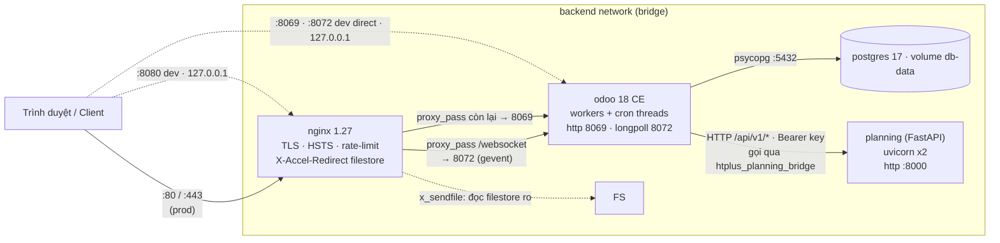
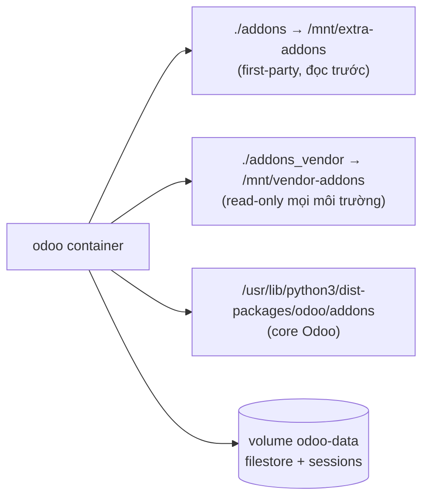
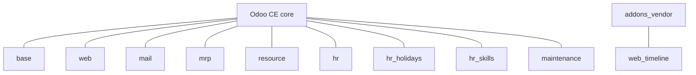
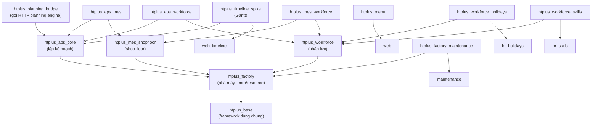
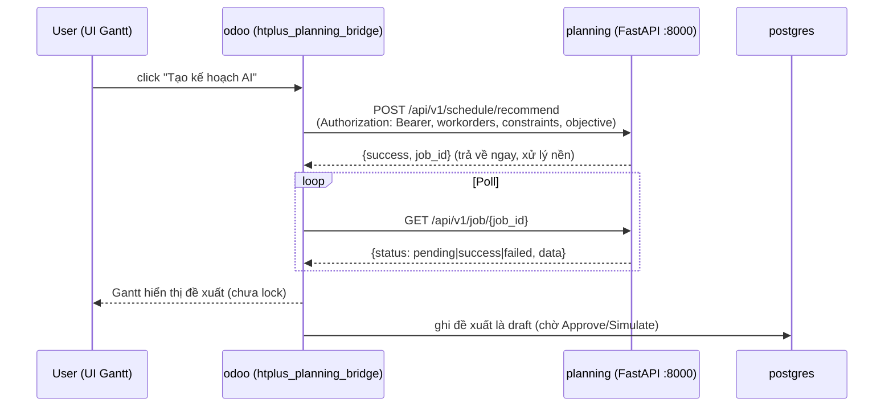

# Kiến trúc hệ thống — HTPlus APS/MES (Odoo 18 CE)

**Cập nhật 2026-08-10** — sơ đồ tổng quan: deployment, module graph, luồng gọi planning engine.
Chi tiết nghiệp vụ/thiết kế: `01`–`05`.

---

## 1. Deployment — các container

Bốn service chạy trong một bridge network `backend`. Chỉ `nginx` publish port (prod), mọi thứ
khác chỉ gọi nhau qua network nội bộ.

**Mount/volume:**

- Thứ tự `addons_path`: `extra-addons` → `vendor-addons` → core: module first-party luôn thắng
  vendor trùng tên.
- `addons_vendor` **read-only ở cả dev lẫn prod**; patch vendor phải làm từ module first-party.
- Dev override mount `./addons` rw (sửa live, `dev_mode = reload`); prod mount `./addons` ro.
- Docker secrets (`*_FILE`) → entrypoint render config 0600 vào `/tmp/odoo.conf`; DB password
  truyền qua CLI args, không bao giờ ghi xuống đĩa.

---

## 2. Module graph — addons Odoo

### 2.1 Tầng nền (standard + vendor)

### 2.2 Dependencies giữa module HTPlus

---

## 3. Luồng runtime — gọi planning engine

Odoo (qua `htplus_planning_bridge`) gọi FastAPI qua HTTP nội bộ `http://planning:8000`. Engine
xử lý nền (thread + job id), Odoo poll kết quả. Contract trả về là `ScheduleResult`
(xem `03_engine.md` §6); engine **không** đụng ORM Odoo.

**Fallback & degraded mode:** forecasting là `moving_average_fallback`, scheduling là
`greedy_fallback` / rule engine, root-cause là `rule_fallback` — response tự gắn nhãn model.
Nếu planning service chết, bridge phải chịu lỗi (retry + degraded mode), không chặn web worker.

---

## 4. Bảng tóm tắt

| Thành phần | Vai trò | Chỉ mở ngoài? |
|---|---|---|
| `nginx` | reverse proxy duy nhất, TLS/HSTS, rate-limit login & RPC, X-Accel-Redirect | Có (80/443, prod) |
| `odoo` | Odoo 18 CE, `proxy_mode=True`, `x_sendfile=True` (prod) | Không (dev: 8069/8072 127.0.0.1) |
| `db` | PostgreSQL 17, volume `db-data` | Không (dev: 5432 127.0.0.1) |
| `planning` | FastAPI sidecar, thread job nền, `/api/v1/*` | Không (dev: 8000 127.0.0.1) |
| `./addons` | module HTPlus first-party | — |
| `./addons_vendor` | module bên thứ ba, ro | — |
| `odoo-data` | filestore + sessions — mất là mất attachments | — |
